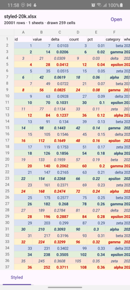
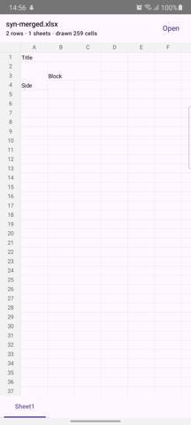
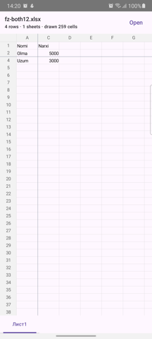
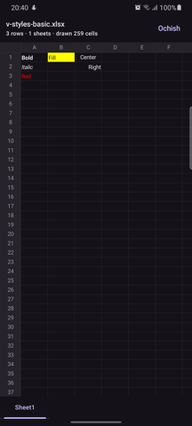
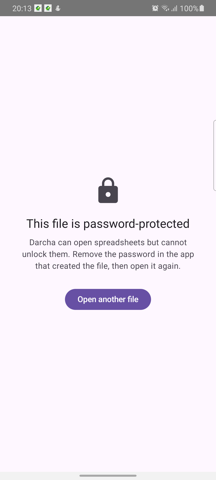
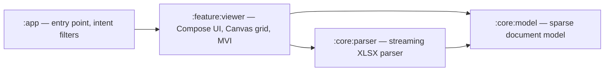

# Darcha — XLSX Viewer for Android

[](https://github.com/Abdurahim1995/Darcha/actions/workflows/ci.yml)
[](#no-network-by-construction)

A fast, private, ad-free Android viewer for `.xlsx` files. It shows the first
cells of a 50,000-row spreadsheet in **175 ms**, ships as a **1.10 MB** APK, and
**cannot send your file anywhere** — there is no `INTERNET` permission in the
manifest.

*Darcha* means **little window** in Uzbek.

<p align="center">
  
</p>

---

## What it does

- Opens `.xlsx` from any file manager (`ACTION_VIEW`) or the system picker
- Multiple sheets, parsed on demand
- Cell styling: bold, italic, text colour, fills, alignment, column widths, row heights
- Number and date formatting, including Excel's 1900 leap-year bug
- Merged cells and frozen panes
- Pinch zoom, fling scrolling, recent files
- English and Uzbek; light and dark

## What it deliberately does not do

Being clear about this is the point, not an apology — the scope was fixed in the
spec before any code was written.

- **No editing.** It is a viewer. Nothing writes to your file.
- **`.xlsx` only.** No `.xls`, no `.xlsm` macros, no `.ods`, no `.csv`.
- **No charts, images, pivot tables, conditional formatting or comments.**
- **No formula engine.** Formula cells show the value Excel cached in the file.
- **No accounts, no analytics, no network.**

Post-v1 candidates are under [Roadmap](#roadmap).

### No network by construction

There is no `INTERNET` permission in
[`AndroidManifest.xml`](app/src/main/AndroidManifest.xml). That is not a promise
in a privacy policy — the app is structurally incapable of uploading your
spreadsheet, and it takes one file to verify.

## Screenshots

Captured on the test device: Samsung Galaxy A31, Android 10.

| Merged cells | Frozen panes | Dark mode | Error states | Recents, in Uzbek |
|---|---|---|---|---|
|  |  |  |  |  |

<!-- GIF SLOT ─ drop an animated capture here once recorded, e.g.:
     
     Stills cannot show motion, and scrolling is the part worth seeing. -->

## Measured

Every number below comes from a **Samsung Galaxy A31** — a mid-range phone from
2020, deliberately not a flagship. Methodology, raw runs and caveats are in
**[docs/PERF.md](docs/PERF.md)**.

| | Measured |
|---|---|
| First cells, `big-50k-rows.xlsx` (1.78 MB, ~350k cells) | **175 ms** |
| Complete parse, same file | 2,380 ms |
| First cells, a typical small file | 86–116 ms |
| Scroll frame time, median — release build / debug build | **12 ms** / 15–18 ms |
| Scroll frame time, 90th percentile | 18 ms / 23–30 ms |
| Cells drawn per frame, whatever the sheet size | **259** |
| APK, signed, R8 + resource shrinking | **1.10 MB** |
| Tests | **350** |

**On frame times.** The 60 fps budget is 16.7 ms. The *median* frame fits inside
it and the 90th percentile does not, so this page is not going to claim "60 fps"
on the strength of a median. The numbers come from `adb`-injected flings, which
are flagged as high-input-latency whatever the renderer does, and the device
drifts thermally over a long session — `docs/PERF.md` records both, and says
where that made one comparison inconclusive.

**On the APK.** 1.10 MB is the signed release build, with R8 and resource
shrinking on in the committed config — against the spec's 5 MB budget. It needs
**no keep rules of our own**: `:core:model` and `:core:parser` use no reflection
and no serialization framework, so R8 can see the whole call graph.
[`app/proguard-rules.pro`](app/proguard-rules.pro) is almost empty and explains
why.

## Architecture



| Module | Platform | Responsibility |
|---|---|---|
| `:core:model` | Pure Kotlin (JVM) | Immutable sparse document model; number and date formatting |
| `:core:parser` | Pure Kotlin (JVM) | Streaming XLSX parser. Depends only on `:core:model` |
| `:feature:viewer` | Android | Compose UI, Canvas grid renderer, MVI ViewModel |
| `:app` | Android | Entry point, intent filters, wiring |

Dependencies run one way only: `:app → :feature:viewer → :core:parser →
:core:model`. The two `:core` modules have **no Android dependency at all** —
they are plain JVM Kotlin, which is why 140 of the tests run in seconds on the
JVM, with no emulator anywhere.

State flows one way too: `Intent → reduce → State → render`, through a single
pure `reduce` function containing no coroutines, no I/O and no Android.

📄 Full specification: **[docs/TECH_SPEC.md](docs/TECH_SPEC.md)**

## Engineering decisions

The six that shaped the codebase most.

### 1. A hand-written streaming parser with zero runtime dependencies

An `.xlsx` is a ZIP of XML parts, so the parser is `java.util.zip.ZipFile` plus
`XmlPullParser` and nothing else — no Apache POI, which would have dwarfed
everything else in the APK. It streams instead of building a DOM, so memory
tracks the cells that exist rather than the size of the file. The payoff shows up
at release time: with no reflection anywhere in `:core:*`, R8 can see the whole
call graph, and the shipped APK needs **no keep rules at all**.

### 2. A sparse model on primitive arrays

A worksheet is a `Map<Int, Row>`, and a `Row` is a sorted `IntArray` of column
indices with parallel value and style arrays — never an object per empty cell.
Cells are addressed by index rather than by position in a dense grid, so a sheet
with data in column A and column ZZ costs what its real cells cost and nothing
for the gap. The renderer's geometry follows the same rule: prefix sums and
binary search, with nothing stored per row.

### 3. Progressive first paint — 2,427 ms → 175 ms

The first measurement of `big-50k-rows.xlsx` was **2,427 ms** to first cell,
against a spec target of one second. The parser was already streaming; the *grid*
was waiting for the last row. Chunks now reach the renderer as partial snapshots
and the first cells arrive in **175 ms** — a 14× improvement in which the parse
itself did not get one millisecond faster.

The follow-on mattered as much. A chunk carries **the layout its rows are sized
by**, because `<cols>` precedes `<sheetData>` in the file. Without that, every
spreadsheet with custom column widths — which is nearly all of them — would
visibly re-lay itself out the moment parsing finished. Checked by cropping a
mid-parse frame and a finished one: byte-identical.

### 4. Merged cells as ranges, not as a set of covered cells

The obvious way to skip covered cells is a `HashSet` of every covered
coordinate. It is also a trap: `A1:C1048576` is a legal merge, and that set would
hold three million entries for one range. `MergeIndex` keeps ranges as ranges —
parallel `IntArray`s sorted by start row, with a running maximum beside them —
and answers per cell with a binary search and a bounded walk. **A lookup
allocates nothing**, which matters because the draw loop makes one per visible
cell, every frame.

### 5. Frozen panes with no seams, by construction

Frozen panes split the grid into four regions that have to meet exactly, at any
zoom. Rather than test for gaps, every boundary is derived from **one number per
axis**: the corner's right edge, the top strip's origin, the body's left clip and
the separator line are all the same `Float`. They cannot disagree, because there
is no rounding step between them in which to disagree. The tests assert it as
exact equality — delta `0f` — at seven zoom levels.

### 6. "The document chose nothing" is not the same as "the document chose black"

Every real Excel file writes `<color theme="1"/>` for ordinary text. Theme 1 is
`dk1`, which every Office theme defines as `<a:sysClr val="windowText"/>` — not a
colour, but a reference to *the system's* text colour. The file has not picked
black; it has declined to pick, and deferred to whatever draws it.

v1.0 resolved it to black, so **almost every cell of almost every real file was
invisible in dark mode**, and the first fix was a heuristic: treat near-black as
"probably default". That guess is now deleted. The model records the distinction
directly — `fontColor` is `null` when nothing was chosen, and never means black —
so what remains is a measurement rather than a guess, and it runs in both
directions. White text on an unfilled cell had been invisible in **light** mode
since the first release, and no amount of near-black detection could have found
it. A cell the document filled is never touched: there it chose both colours, and
black on the author's yellow is a pairing, not an accident.

## Testing

**350 tests** — 38 in `:core:model`, 102 in `:core:parser`, 210 in
`:feature:viewer`. The 140 in `:core:*` are pure JVM and need no emulator.

The parser is fixture-driven and the rule is absolute: **no fixture, no
feature.** Every parser capability ships with a real `.xlsx` file and
golden-value assertions read *out of that file* rather than typed from memory —
a discipline that has more than once caught a case where the code was right and
the expectation was wrong.

Fixtures are grouped **by the tool that produced them**, because producers
disagree about how to write the same spreadsheet, and a parser tested only
against its own output never finds that out. Half the corpus comes from
Microsoft Excel Online and is golden-locked; the rest is generated with openpyxl,
plus one file whose OOXML was written by hand — because openpyxl turns out to
*never* emit a shared string table, so nothing else in the corpus would have
exercised that path at all. Google Sheets, LibreOffice and WPS have folders
waiting, and the checker that validates fixtures is read-only by design: re-saving
a file through another application destroys the producer identity that made it
worth having. Every fixture and its expected values are documented in
[FIXTURES.md](core/parser/src/test/resources/fixtures/FIXTURES.md).

Behaviour that cannot be unit-tested is measured on real hardware and written
down — including what could *not* be verified, and why:
**[docs/PERF.md](docs/PERF.md)**.

## Build

Requires **JDK 17** and the Android SDK.

```bash
./gradlew build                                 # full build + all tests
./gradlew :core:model:test :core:parser:test    # fast pure-JVM tests
./gradlew :app:assembleDebug                    # debug APK
./gradlew :app:assembleRelease                  # release APK, R8 + shrinking
```

A release build is unsigned unless a `keystore.properties` is present — CI has no
keystore and does not need one. [docs/RELEASE.md](docs/RELEASE.md) covers signing
setup and the release checklist.

## Roadmap

Post-v1 candidates, from [TECH_SPEC §14](docs/TECH_SPEC.md):

- DOCX viewer via HTML → WebView — a deliberate second rendering strategy
- Text selection, copy, and in-sheet search
- Basic charts and embedded images
- F-Droid publication

## How this was built

The engineering *method* is part of this portfolio, not just the result. The
process is deliberate and auditable:

- **Spec-first.** Scope and architecture are fixed in
  [docs/TECH_SPEC.md](docs/TECH_SPEC.md) before any code is written. It is the
  single source of truth — changing scope means editing the spec first.
- **Task-by-task playbook.** Work follows [docs/PLAYBOOK.md](docs/PLAYBOOK.md),
  a fixed sequence of small tasks (T0 → T26). **One task = one commit**, so the
  git history reads as a step-by-step build log.
- **Claude Code as the implementation agent.** Claude Code writes the diffs;
  **every diff is human-reviewed** before it lands. All architectural decisions
  are made and documented by the owner (in the spec and the task prompts) — the
  agent implements within those constraints, it does not set direction.
- **Transparency as a feature.** `Co-Authored-By` trailers are kept
  intentionally on every commit rather than stripped — the process is meant to
  be legible, not hidden.
- **Fixture-driven parser.** Every parser feature ships with a fixture file and
  a golden-value test. The corpus and its expected values are documented in
  [FIXTURES.md](core/parser/src/test/resources/fixtures/FIXTURES.md).
