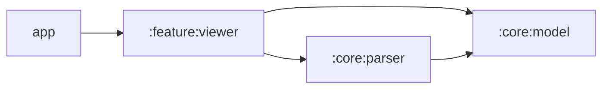

# Darcha — XLSX Viewer for Android

**Technical Specification · v1.0**

| | |
|---|---|
| Status | Approved — ready for M1 |
| Owner | Tikoncha |
| Last updated | 2026-07-14 |
| Working title | **Darcha** (*"little window" in Uzbek*) |

---

## 1. Summary

Darcha is a fast, private, ad-free Android viewer for `.xlsx` files. It opens spreadsheets instantly, works fully offline, ships without the `INTERNET` permission, and stays under 5 MB.

This is a portfolio project. Its primary purpose is to demonstrate senior-level Android engineering: a hand-written streaming parser for a binary-adjacent format, a custom 60 fps Canvas renderer, clean MVI architecture, and disciplined fixture-driven testing.

## 2. Motivation

Existing options are either heavy and ad-driven (Microsoft 365) or cloud-oriented (Google Sheets). There is room for a viewer whose entire identity is: **instant, offline, small, quiet**. Privacy is a feature: the app cannot send your file anywhere because it has no network access at all.

## 3. Goals (v1.0)

- Open `.xlsx` from any file manager (`ACTION_VIEW` intent filter) and via in-app SAF picker
- Multiple sheets with tab switching
- Smooth two-directional scrolling over large sheets (tens of thousands of rows)
- Pinch-to-zoom
- Core formatting: bold/italic, text color, fill color, alignment, column widths, row heights
- Merged cells and frozen panes
- Formula cells display their **cached values** (no evaluation)
- Graceful, human-readable errors: corrupted files, password-protected files, unsupported formats

## 4. Non-goals (v1.0)

- Editing of any kind
- `.xls` (legacy BIFF), `.xlsm` macros, `.csv`
- Charts, embedded images, pivot tables, conditional formatting, comments
- Formula evaluation engine
- Cloud sync, accounts, analytics

Deliberately small. Each item above is a candidate for post-v1, not scope creep for v1.

## 5. Product principles (measurable)

1. **Time-to-first-cell < 1 s** for typical files (< 5 MB) on a mid-range device
2. **60 fps scroll** on a mid-range device
3. **APK < 5 MB**
4. **Zero network** — no `INTERNET` permission in the manifest
5. **Every parser feature is fixture-tested** — no fixture, no feature

## 6. Architecture

### Modules

| Module | Platform | Responsibility |
|---|---|---|
| `:core:model` | Pure Kotlin (JVM) | Immutable document model shared by parser and UI |
| `:core:parser` | Pure Kotlin (JVM) | Streaming XLSX parser. Depends only on `:core:model` |
| `:feature:viewer` | Android | Compose UI, Canvas grid renderer, MVI ViewModel |
| `:app` | Android | Entry point, intent filters, DI wiring |



### Pattern

MVI with strict unidirectional flow:

```
Gesture / UI event → Intent → ViewModel (reduce) → State → Canvas render
```

## 7. Parser design (`:core:parser`)

**Zero third-party runtime dependencies.** An `.xlsx` file is a ZIP archive containing OOXML XML parts. Tooling: `java.util.zip.ZipFile` + `XmlPullParser` (built into Android; `kxml2` added as a *test-only* dependency so the pure-JVM module can run unit tests).

### Pipeline (read order)

1. **Container detection.** ZIP magic `PK\x03\x04` → proceed. OLE/CFB magic `D0 CF 11 E0` → the file is encrypted (or legacy `.xls`) → surface a clear user-facing error, never a crash.
2. `xl/workbook.xml` + `xl/_rels/workbook.xml.rels` → ordered sheet list (name, relId → part path), `date1904` flag.
3. `xl/sharedStrings.xml` → shared string table, streamed. (Excel deduplicates text: cells store an index into this table.)
4. `xl/styles.xml` → resolve `cellXfs` → font / fill / alignment / `numFmtId`. **Built-in number formats (ids 0–163) are not stored in the file** — the spec assumes them; we ship a hardcoded table.
5. `xl/worksheets/sheetN.xml` → streamed row by row into the sparse model. **Progressive loading:** the first ~200 rows are emitted to the UI immediately; the rest continues on `Dispatchers.IO`.

### Cell types

`n` number (default) · `s` shared string · `inlineStr` · `b` boolean · `e` error · `str` formula string result. For formula cells, the `<f>` element is skipped and the cached `<v>` value is used.

### Known traps (owned explicitly)

- **Dates** are plain numbers; date-ness is inferred from the number format (built-in ids 14–22, 45–47, or custom formats containing `y/m/d/h/s` tokens). The 1900 epoch includes Excel's intentional leap-year bug (Lotus 1-2-3 compatibility); the `date1904` flag switches the epoch entirely.
- **Column widths** are stored in "character units" of the workbook's default font. Conversion to pixels uses the documented `maxDigitWidth` formula and is centralized in one function.
- **Producer variance.** Excel, LibreOffice, Google Sheets and WPS all emit different XML (e.g. `inlineStr` vs shared strings). The fixture corpus must include files from all four.

## 8. Data model (`:core:model`)

- **Sparse.** Only existing cells are stored. Rows: `Map<Int, Row>`; each `Row` holds a sorted `IntArray` of column indices with parallel value/style arrays. No per-empty-cell objects, ever.
- **Immutable snapshots** — stable inputs for Compose.
- A cell stores a **raw value + styleId** (`Number | SharedText(index) | InlineText | Bool | Error`), not a formatted string. Display strings are computed lazily at render time and LRU-cached.

## 9. Rendering (`:feature:viewer`)

- The grid is a **single Canvas composable**; surrounding chrome (toolbar, sheet tabs, error states) is regular Compose.
- **Viewport culling:** from `(scrollX, scrollY, zoom)`, the visible row/column range is computed via prefix-sum offset arrays + binary search. Only visible cells are drawn.
- **Text:** `TextMeasurer`, with a cache keyed by `(text, styleId, zoom bucket)` — measuring is expensive.
- **Gestures:** drag + fling (velocity tracker), pinch zoom (focal-point aware), tap → cell hit-test. All gestures dispatch MVI intents; the Canvas only reads State.
- **Frozen panes:** four clipped regions with translated origins.
- **Merged cells:** drawn once at the anchor cell spanning the merged bounds; covered cells are skipped.

## 10. MVI contract (sketch)

```kotlin
sealed interface ViewerState {
    data class Parsing(val progress: Float) : ViewerState
    data class Ready(
        val docMeta: DocumentMeta,
        val activeSheetId: Int,
        val viewport: Viewport,   // scrollX, scrollY, zoom
        val selection: CellRef?,
    ) : ViewerState
    data class Error(val kind: ErrorKind) : ViewerState  // Corrupted, Encrypted, Unsupported, TooLarge
}

sealed interface ViewerIntent {
    data class OpenFile(val uri: Uri) : ViewerIntent
    data class SwitchSheet(val id: Int) : ViewerIntent
    data class Scroll(val dx: Float, val dy: Float) : ViewerIntent
    data class Fling(val vx: Float, val vy: Float) : ViewerIntent
    data class Zoom(val scale: Float, val focalX: Float, val focalY: Float) : ViewerIntent
    data class TapCell(val x: Float, val y: Float) : ViewerIntent
    data object Retry : ViewerIntent
}
```

## 11. Milestones

| # | Deliverable | Acceptance criteria |
|---|---|---|
| **M1** | Parser core, no UI | `:core:parser` reads workbook, shared strings, styles and sheet data into the sparse model. Fixture corpus ≥ 20 files from 4 producers. Golden-value unit tests green in CI. |
| **M2** | Raw grid on screen | Canvas grid renders values; 2D scroll + fling; sheet tabs. A 50k-row file scrolls smoothly on a mid-range device. |
| **M3** | Fidelity | Fonts/fills/alignment, number & date formatting, merged cells, frozen panes, pinch zoom. |
| **M4** | Product polish | `ACTION_VIEW` intent filter, SAF picker, recent files, error states, app icon, README with GIFs + measured metrics, CI badge, release APK on GitHub Releases. |

## 12. Testing strategy

- `:core:parser` and `:core:model` are pure JVM → fast unit tests, no emulator.
- **Fixture corpus** lives in the repo (small files, 4 producers) with golden expected values per fixture.
- Rule of engagement: a parser bug is only fixed together with a fixture that reproduces it.
- Later: Compose UI tests for tabs/error states; macrobenchmark for time-to-first-cell (stretch).

## 13. Risks & mitigations

| Risk | Mitigation |
|---|---|
| OOXML edge cases are endless | Strict scope + fixture-driven development: we only support what a fixture proves |
| Canvas gesture/coordinate math complexity | Isolated early in M2, before any formatting work |
| Huge files → OOM | Streaming parse, sparse model, explicit cell-count cap with a friendly `TooLarge` error |
| Motivation drift (portfolio project) | Milestone acceptance criteria; a runnable build ships at M2, not at the end |

## 14. Future (post-v1 candidates)

- DOCX viewer via HTML → WebView (a deliberate second rendering strategy)
- Text selection & copy, in-sheet search
- Basic charts, embedded images
- F-Droid publication

---

*This document is the single source of truth for v1.0 scope. Changes to scope require editing this file first.*
