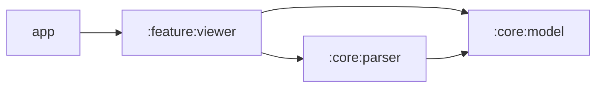

# Darcha — XLSX Viewer for Android

**Technical Specification · v1.0**

| | |
|---|---|
| Status | Approved — ready for M1 |
| Owner | Tikoncha |
| Last updated | 2026-07-14 |
| Working title | **Darcha** (*"little window" in Uzbek*) |

---

## 1. Summary

Darcha is a fast, private, ad-free Android viewer for `.xlsx` files. It opens spreadsheets instantly, works fully offline, ships without the `INTERNET` permission, and stays under 5 MB.

This is a portfolio project. Its primary purpose is to demonstrate senior-level Android engineering: a hand-written streaming parser for a binary-adjacent format, a custom 60 fps Canvas renderer, clean MVI architecture, and disciplined fixture-driven testing.

## 2. Motivation

Existing options are either heavy and ad-driven (Microsoft 365) or cloud-oriented (Google Sheets). There is room for a viewer whose entire identity is: **instant, offline, small, quiet**. Privacy is a feature: the app cannot send your file anywhere because it has no network access at all.

## 3. Goals (v1.0)

- Open `.xlsx` from any file manager (`ACTION_VIEW` intent filter) and via in-app SAF picker
- Multiple sheets with tab switching
- Smooth two-directional scrolling over large sheets (tens of thousands of rows)
- Pinch-to-zoom
- Core formatting: bold/italic, text color, fill color, alignment, column widths, row heights
- Merged cells and frozen panes
- Formula cells display their **cached values** (no evaluation)
- Graceful, human-readable errors: corrupted files, password-protected files, unsupported formats

## 4. Non-goals (v1.0)

- Editing of any kind
- `.xls` (legacy BIFF), `.xlsm` macros, `.csv`
- Charts, embedded images, pivot tables, conditional formatting, comments
- Formula evaluation engine
- Cloud sync, accounts, analytics

Deliberately small. Each item above is a candidate for post-v1, not scope creep for v1.

## 5. Product principles (measurable)

1. **Time-to-first-cell < 1 s** for typical files (< 5 MB) on a mid-range device
2. **60 fps scroll** on a mid-range device
3. **APK < 5 MB**
4. **Zero network** — no `INTERNET` permission in the manifest
5. **Every parser feature is fixture-tested** — no fixture, no feature

## 6. Architecture

### Modules

| Module | Platform | Responsibility |
|---|---|---|
| `:core:model` | Pure Kotlin (JVM) | Immutable document model shared by parser and UI |
| `:core:parser` | Pure Kotlin (JVM) | Streaming XLSX parser. Depends only on `:core:model` |
| `:feature:viewer` | Android | Compose UI, Canvas grid renderer, MVI ViewModel |
| `:app` | Android | Entry point, intent filters, DI wiring |


```mermaid
graph LR
    app --> viewer[":feature:viewer"]
    viewer --> parser[":core:parser"]
    viewer --> model[":core:model"]
    parser --> model
```

### Pattern

MVI with strict unidirectional flow:

```
Gesture / UI event → Intent → ViewModel (reduce) → State → Canvas render
```

## 7. Parser design (`:core:parser`)

**Zero third-party runtime dependencies.** An `.xlsx` file is a ZIP archive containing OOXML XML parts. Tooling: `java.util.zip.ZipFile` + `XmlPullParser` (built into Android; `kxml2` added as a *test-only* dependency so the pure-JVM module can run unit tests).

### Pipeline (read order)

1. **Container detection.** ZIP magic `PK\x03\x04` → proceed. OLE/CFB magic `D0 CF 11 E0` → the file is encrypted (or legacy `.xls`) → surface a clear user-facing error, never a crash. A ZIP whose first entry is an OpenDocument `mimetype` → `Unsupported`, not `Corrupted`: it is an intact spreadsheet of the wrong kind, and saying "damaged" about it is simply false (T27).

   The ODF check stays inside this step's budget — a single short header read, no archive open. OpenDocument v1.2 §3.3 requires the `mimetype` entry to be **first**, **stored**, and to carry **no extra field**, which pins the media type to byte 38. Every one of those rules is verified and any deviation is treated as "not ODF", so the check can miss but never misfire.

   **Out of scope here, on purpose:** `.xlsb`, `.docx` and other OOXML ZIPs. Their only discriminator is `[Content_Types].xml`, reachable only through the central directory at the end of the archive, so identifying them costs an archive open — which is what this step exists to avoid. They continue to reach step 2 and report `Corrupted`. The honest home for that check is step 2, where the `ZipFile` is already open.
2. `xl/workbook.xml` + `xl/_rels/workbook.xml.rels` → ordered sheet list (name, relId → part path), `date1904` flag.
3. `xl/sharedStrings.xml` → shared string table, streamed. (Excel deduplicates text: cells store an index into this table.)
4. `xl/styles.xml` → resolve `cellXfs` → font / fill / alignment / `numFmtId`. **Built-in number formats (ids 0–163) are not stored in the file** — the spec assumes them; we ship a hardcoded table.
5. `xl/worksheets/sheetN.xml` → streamed row by row into the sparse model. **Progressive loading:** the first ~200 rows are emitted to the UI immediately; the rest continues on `Dispatchers.IO`.

### Chunks carry their layout

A chunk is not just rows — it also carries the layout those rows are **sized** by (`RowsChunk.layout`), so a progressive renderer places them correctly on first paint instead of laying the sheet out again when the parse ends. Almost every real business spreadsheet sets column widths, so drawing partial results at the default width would make reflow-on-completion the normal case, not an edge case.

What a chunk knows follows directly from the order of the XML:

| Layout part | In a chunk | Why |
|---|---|---|
| Column widths, `defaultColWidth`, `defaultRowHeight` | **Complete from the first chunk** | `<cols>` and `<sheetFormatPr>` precede `<sheetData>`, so the column axis is final before any row exists. One instance is shared by every chunk of a sheet. |
| Row heights | **A delta, like the rows themselves** | A row's `ht` arrives with the row, so a chunk is always drawable at its true height. Consumers merge chunk layouts exactly as they merge chunk rows (`putAll`). |
| Frozen panes | **Complete from the first chunk** | `<sheetViews>` precedes `<sheetData>` as well — verified on six fixtures including two real Excel files. They *have* to be early: panes split the grid into four scrolling regions, so learning them mid-parse would re-lay the sheet and move the scroll position under the reader (T19). |
| Merges | **Never** | `<mergeCells>` follows `<sheetData>`, so it arrives with the finished `Worksheet`. Nothing in the file reveals it sooner. |

**The asymmetry between panes and merges is deliberate.** It follows from where each element sits in the file, and the two have very different costs when they arrive late. Frozen panes change the *layout*; a merge only repaints one range. Do not "unify" them.

**What a late merge looks like on screen (T18).** A merged title is drawn as an ordinary cell until the parse finishes, then becomes a span: its text stops being clipped to the first column and its fill widens. Nothing else changes — verified on a 50k-row file with 501 merges, where every pixel below the merged row is byte-identical before and after the merges arrive. Merges are cosmetic, and waiting for them would cost the progressive paint that T15.5 exists for. See `docs/PERF.md`.

**Row heights streaming is not a gap to fix.** Later rows only shift rows *below* them, which have not been drawn yet — a row is never moved after it is on screen. Only the column axis had to be known up front, and it is.

### Cell types

`n` number (default) · `s` shared string · `inlineStr` · `b` boolean · `e` error · `str` formula string result. For formula cells, the `<f>` element is skipped and the cached `<v>` value is used.

### Known traps (owned explicitly)

- **Dates** are plain numbers; date-ness is inferred from the number format (built-in ids 14–22, 45–47, or custom formats containing `y/m/d/h/s` tokens). The 1900 epoch includes Excel's intentional leap-year bug (Lotus 1-2-3 compatibility); the `date1904` flag switches the epoch entirely.
- **Column widths** are stored in "character units" of the workbook's default font. Conversion to pixels uses the documented `maxDigitWidth` formula and is centralized in one function.
- **Producer variance.** Excel, LibreOffice, Google Sheets and WPS all emit different XML (e.g. `inlineStr` vs shared strings). The fixture corpus must include files from all four.

## 8. Data model (`:core:model`)

- **Sparse.** Only existing cells are stored. Rows: `Map<Int, Row>`; each `Row` holds a sorted `IntArray` of column indices with parallel value/style arrays. No per-empty-cell objects, ever.
- **Immutable snapshots** — stable inputs for Compose.
- A cell stores a **raw value + styleId** (`Number | SharedText(index) | InlineText | Bool | Error`), not a formatted string. Display strings are computed lazily at render time and LRU-cached.

### Formatting (T16)

`ValueFormatter` turns a raw value into text; `FormattedValueCache` is the LRU in front of it, keyed by `(value bits, styleId)` and scoped to one workbook (style ids and shared-string indices mean nothing outside it).

| Decision | Choice | Why |
|---|---|---|
| **Locale** | None. `.` decimal separator, `,` thousands. Month and weekday names are **injected** (`DateNames`), defaulting to English. | The format code in the file says `#,##0.00`; rendering `1.234,56` would show something the author never wrote. Names are different: Excel resolves them against the authoring locale, which a viewer cannot recover — so they are an input, and `:core:model` stays locale-free. T24 supplies Uzbek names from the UI layer. |
| **`General` width** | Fixed digit budget (11 significant), not column-width dependent. | Excel shows fewer digits in a narrow column. A value must not change its text because the user dragged a column edge. |
| **Format coverage** | `General`, `0`, `0.00`, `#,##0`, `#,##0.00`, `0%`, `0.00%`, and all date/time codes. Everything else renders as `General`. | Fractions, accounting and scientific builtins are rare; a plain number beats a confidently wrong rendering. |
| **1900-02-29** | Reproduced, not corrected. | See §7 traps and `ExcelSerial` — "fixing" it would shift every pre-1900-03-01 date away from what the authoring app shows. |
| **Negative date serial** | Falls back to a plain number. | Excel fills the cell with `#####`, which tells the reader nothing. |

## 9. Rendering (`:feature:viewer`)

- The grid is a **single Canvas composable**; surrounding chrome (toolbar, sheet tabs, error states) is regular Compose.
- **Viewport culling:** from `(scrollX, scrollY, zoom)`, the visible row/column range is computed via prefix-sum offset arrays + binary search. Only visible cells are drawn.
- **Text:** `TextMeasurer`, with a cache keyed by `(text, styleId, zoom bucket)` — measuring is expensive.
- **Gestures:** drag + fling (velocity tracker), pinch zoom (focal-point aware), tap → cell hit-test. All gestures dispatch MVI intents; the Canvas only reads State.
- **Frozen panes:** four clipped regions — corner, frozen rows, frozen columns, body — each drawn by the ordinary unfrozen code with its frozen axes' scroll zeroed and its origin pushed past the frozen strips (T19).

### Frozen panes, and why there are no seams (T19)

Every boundary is derived from **one number per axis**: the frozen extent, `spanWidthOf(0, frozenCols - 1)`. The corner's right edge, the top strip's origin, the body's left clip and the separator line are all that same `Float`, so they cannot disagree at any zoom — there is no rounding step between them to disagree in. The regions are half-open and adjacent, so they tile the grid area exactly.

Scrolling gains a **floor**: the scrolling region starts at the first unfrozen column, and letting scroll fall below that would draw the frozen columns a second time inside the body. The floor is clamped in two places on purpose — in the reducer via `ScrollBounds`, and again inside the region maths, because the renderer publishes the bounds *after* the first composition and the first frame would otherwise be drawn unclamped.
- **Merged cells:** drawn once at the anchor cell spanning the merged bounds; covered cells are skipped.

### Range selection and TSV (T34)

Selection is a `CellRange`. A plain tap gives a 1×1 range, so T29's single-cell
behaviour is the same behaviour it always was — the type widened, not the
semantics. **Long-press then drag** extends it: a one-finger drag already
scrolls, so range selection cannot use a plain drag without stealing it, and a
long press requires the finger to stay still and therefore produces no scroll.

**A range containing any part of a merge contains all of it.** A rectangle that
clips half a merged title is not something a spreadsheet can express — half a
merge holds no value and has no outline that makes sense. Widening iterates to a
fixed point, because swallowing one merge can bring the rectangle into contact
with another that reaches further still; it terminates because the rectangle only
grows and the sheet is finite. The renderer does the widening, since it is the
only place that knows where the merges are, and the outline then follows the
expanded shape rather than the dragged one.

**TSV, so a paste lands as cells rather than as one string in one cell.** Tab
between columns, newline between rows. An empty cell is an **empty field** —
dropping it shifts every later value into the wrong column, which turns a paste
from an inconvenience into corrupt data. A merged cell contributes its value once
at its anchor with empties for the cells it covers, which is what the file itself
contains. The **displayed** text is exported, the same decision as the
single-cell copy. A value containing a tab, newline or quote is quoted with
internal quotes doubled: one such cell, emitted bare, silently rewrites the whole
paste into the wrong shape.

**Dragging across frozen regions** resolves every position through the same
region-aware hit-test a tap uses (§9, T29), so a drag that starts in a frozen
column and crosses into the body anchors on the frozen column rather than on
whatever the body shows under that pixel.

### Search (T32/T33)

**Active sheet only.** Other sheets are read on demand (§7), so searching them
would turn a search into a parse of the whole workbook. Cross-sheet search is
deferred, not forgotten.

**Both readings of a cell, one hit each.** The displayed string and the raw
value — someone typing `Toshkent` is reading the screen, someone typing `45306`
knows the serial under a date. The code makes that nearly free: only a number
has two readings, since text renders as itself and a boolean as `TRUE`/`FALSE`.
Case-insensitive substring, because a viewer's reader is looking for something
half-remembered.

**The scan never touches the renderer's `FormattedValueCache`.** It holds 2,048
strings sized for a viewport; scanning 350,000 cells through it would evict
everything the grid needs and make scrolling stutter. The scan builds its own and
drops it; text cells skip the formatter entirely.

**Results are pinned to one immutable snapshot.** A chunk arriving means a new
`SheetData`, so the reducer drops the old matches rather than carrying them — an
index into a stale list is how next/previous ends up at a cell that moved. The
state can therefore never hold results for a sheet other than the one on screen,
and nothing downstream has to remember to check. While the sheet is still growing
the count is shown as **provisional**, because it is.

**Interaction, decided rather than left to emerge:**

- Stepping to a match **selects** it, so the selection bar shows its value and
  the Copy button does the obvious thing.
- A manual tap moves the selection and **keeps** the search. Clearing matches
  because the reader glanced at a neighbouring cell would be hostile.
- Scrolling away keeps the highlight; it is state, not a function of the
  viewport. Stepping brings it back via T31.
- A touch during a fling still stops the fling rather than selecting (T29).

**Two levels of highlight, both measured against what is behind them.** A
highlight sits on whatever fill the document chose, and §9's text rule already
proved a single fixed colour cannot survive that. Each level carries two
candidates and the drawing code picks per cell with the same contrast
measurement — an outline that would vanish into the author's yellow is swapped
for its opposite.

### Scrolling a cell into view (T31)

Bringing a target cell on screen is the prerequisite for search, and it has one
real difficulty: **frozen rows and columns are drawn over the body**, so a scroll
computed against the whole canvas can park a cell underneath one — on screen by
the arithmetic, invisible to the reader, and with nothing anywhere to report it.

The answer is structural rather than defensive. Everything is solved inside the
**body's own content window**, `[scroll, scroll + extent]`, where *visible* means
`start >= scroll + margin`. Because `scroll` is the unknown being solved for, the
target's content coordinate always ends up at or past where the body begins
drawing. There is no guard against the frozen band because no code path can
produce the failure. The frozen strips enter the calculation in exactly one
place — they shorten `extent` — which is the same "one number per axis" property
that keeps §9's pane seams closed.

Three rules resolve in order: a target already comfortably visible does not move
the viewport at all; a range too large to frame shows its **start**, which for a
merge is the anchor that carries the value; otherwise the smallest movement that
satisfies the margin.

**Margin is half a default cell per axis** — one number per axis taken from the
document's own metrics, so scrolling to any two cells leaves the same visual gap,
capped at a quarter of the window so it can never make a target unplaceable. A
cell flush against the frozen band is technically visible and practically
unreadable.

**Where clamping and the frozen offset meet**, the outcome is provable rather
than lucky. The scroll floor is `minScroll`, the content coordinate at which the
body starts, and a non-frozen target is by definition at or past it — so the
clamp can cost the target its margin but never its visibility. A cell *inside*
the frozen band is on screen by construction and its axis is left alone.

### Cell selection, and where a tap is resolved (T29)

A tap selects a cell; the selection is drawn as an outline and its value can be
copied. Three decisions are worth stating.

**The renderer resolves the tap, not the reducer.** `ViewerIntent.SelectCell`
carries a `CellRef`, not the tap's pixel, because a screen coordinate means
nothing without the geometry that produced it — column widths, the zoom, and
*which of the four frozen regions the point landed in*, each with its own origin.
All of that lives in the renderer. The reducer stays a pure function with no
layout in it (§10), exactly as `Fling` is resolved into `Scroll`s by the
ViewModel: resolution happens wherever the knowledge is.

**Hit-testing goes through the regions, and that is the whole difficulty.** After
subtracting a region's origin and reading it with that region's viewport, the
calculation is the ordinary unfrozen one — the same property the drawing code
relies on. Get it wrong and a tap in the frozen corner silently returns the
body's cell: a wrong answer that looks like a rendering bug. A tap inside a
merged range resolves to the **anchor**, and the outline spans the whole range.

**A touch during a fling stops it and selects nothing.** That is what every
scrollable surface on the platform does, and the case that feels broken when it
is missing. A tap that lands nowhere — the header strips, past the last row —
clears the selection rather than guessing.

Selection lives in `ViewerState.Ready`, so it survives rotation, and it resets on
sheet switch because A1 of the next sheet is not the cell that was selected on
this one.

### Theme, and the one place dark mode changes a document (T24)

Material 3, light or dark by system setting, and the grid's own colours —
gridlines, header strips, the freeze marker — move with it, so dark mode does not
stop at the edge of the sheet. Dynamic colour is deliberately unused: the
wallpaper deciding what a gridline looks like would make the same spreadsheet
read differently on two phones, and the sheet is the product.

### Text colour: what the document chose, and what it left to us (T28)

**Every real Excel file writes `<color theme="1"/>` for ordinary text.** Theme
index 1 is `dk1`, and in every Office theme `dk1` is written
`<a:sysClr val="windowText"/>` — not a colour but a reference to *the system's*
text colour. So the file has not chosen black; it has explicitly declined to
choose, and deferred to whatever is drawing it.

The model records that. `CellStyle.fontColor` is `null` when the document chose
nothing — absent, `auto`, or a system-colour theme reference — and non-null only
when it really picked a value. **`null` never means black**, and an author who
wants black gets `rgb="FF000000"` and a non-null `Color`. That single distinction
is what T24's near-black heuristic was standing in for; the heuristic is deleted,
not kept as a fallback.

Two things then decide, in order:

1. **No choice → the theme's text colour.** Light or dark, whichever is running.
2. **A choice → honour it, unless it cannot be seen on a background *we* chose.**
   An unfilled cell has no background of its own; it shows the app's surface. So
   a colour picked against Excel's white sheet can land on our dark surface, and
   one picked against a dark sheet can land on our light one. Where the contrast
   ratio falls below **1.5:1**, the theme's text colour is used instead.

This is symmetric, and that matters: white text on an unfilled cell was invisible
in **light** mode from v1.0 onward, and no amount of near-black detection could
have found it.

Bounded, so it rescues rather than rewrites:

- **Never on a filled cell.** There the document chose *both* colours, so the
  pairing is its own — black on the author's yellow stays black, white on the
  author's navy stays white, whatever the ratio.
- **Never as a contrast *enforcer*.** WCAG's 4.5:1 is a design target; applying
  it here would override deliberate styling. Grey `#999999` on our light surface
  measures 2.8:1 and is left alone. The threshold sits in the gap between
  "invisible" (black on our dark surface is 1.09:1) and "quiet on purpose".

#### Decision: `xl/theme/theme1.xml` is not read, and here is why

Reading the theme part would be more faithful, and it is deliberately not done.

The colours that cause the legibility problem — theme 0 and 1, `lt1` and `dk1` —
are `sysClr` references in the theme file itself. Resolving them would yield
`window` and `windowText`, which is precisely the "let whoever draws it decide"
that the model now represents directly. **Parsing the theme part would not change
the answer for the case this section is about.**

What reading it *would* fix is different and narrower: theme indices 2–11 (`dk2`,
`lt2` and the six accents) are fixed RGB, and the parser currently flattens all
of them to black. That is a **fidelity** gap, not a legibility one — text is the
wrong colour, but it is visible — and closing it needs the theme part, the
`lt1`/`dk1` index swap, and `tint` handling, with fixtures for each. That is its
own task, not a rider on this one. `StylesParserTest.themes2To11_areStillFlattenedToBlack_aKnownGap`
pins the current behaviour so that changing it is a deliberate act.

### Launcher icon, and the safe zone that was got wrong

A four-pane window: *darcha* means little window, and a four-pane window is
already a spreadsheet grid — one shape, two readings. The panes are deliberately
unequal (interior 38 × 32, split **14:21** across and **11:18** down), so the
mullions cross above and left of centre. That offset is what carries the
spreadsheet reading; an evenly quartered window is just a window. One pane is
filled — the top-left, because that is where a spreadsheet starts.

Pure vector, no raster assets anywhere in the app.

**The safe zone is a circle, not a square, and the first version confused the
two.** An adaptive icon's canvas is 108 units; the mask can show at most a
**36-unit radius** and the guidance is to stay inside **33**. The original
artwork was inset 21 units on each side — a 66-unit *square* — which the file's
own comment described as "the 66dp safe zone". The sides fitted; the corners did
not. Its frame reached **r ≈ 38.5**, past even what the mask can show, so circle
and One UI masks shaved the corners and the white frame stopped reading as a
window inside a field and started reading as the icon's silhouette.

The replacement is measured rather than assumed. The outermost point is a corner
arc: centre offset (17, 14) → r = 22.02, plus the 5-unit corner radius and half
the 6-unit stroke → **r = 30.02**, leaving ~3 units inside the recommendation and
~6 inside the hard limit. **Check the corners, not the edges.**

**Stroke weights follow from the smallest size the icon must survive.** The
canvas maps its centre 72 units onto the icon, so one unit is `size / 72` dp — at
a 48dp icon, 0.667dp, which is 0.667px on an mdpi screen:

| Units | at a 48dp icon, mdpi |
|---|---|
| 2 | 1.33 px — sub-pixel, aliases into a smudge |
| 3 | 2.00 px — the floor for a crisp line |
| 6 | 4.00 px |

Hence **frame 6, mullions 3 — a 2:1 ratio**, which keeps the frame visibly
heavier (as both real windows and real spreadsheets are drawn) while both land on
whole pixels. Data lines inside the panes were designed and dropped for the same
reason: two 2-unit strokes are 1.33px each and collapse into one mark.

**The monochrome layer is designed, not inherited.** A themed icon is re-tinted
whole, so the accent pane and the white frame become the same ink; filling the
top-left pane would butt it against a 6-wide frame and a 3-wide mullion and merge
into a blob at 48dp. The accent is therefore an inset block with 3 units of clear
ground on every side. A *hollow* pane was the first idea and the geometry rules
it out: that pane's interior is 14 × 11, the smallest of the four, and an outline
inset far enough not to touch and stroked heavily enough to survive leaves a hole
of about 5 × 2 units — 3.3 × 1.3 px at 48dp, which closes up.

Deliberately absent: any letterform, and any Excel/Word/PDF-style mark inside the
panes. The letter said nothing to anyone who does not read Latin script; the
format marks are unreadable at 48dp, promise formats this app does not open, and
are other companies' trademarks.

### Localization (T24)

Default English, `values-uz` in Uzbek latin. Uzbek is the primary audience, so it
is written as its own copy rather than translated sentence-by-sentence, using the
domain's own words — *varaq*, *qator*, *ustun*, *jadval*.

Both languages are held to the same rules by the same test, which reads the
`strings.xml` files directly: no internal terms, every string present in every
language, every error body offering an action, and no "translation" that is still
the English string.

**Month and weekday names are resources**, resolved by the UI and injected into
the formatter as `DateNames`. That argument exists for exactly this: `:core:model`
formats dates without knowing what a locale is.

## 9.1 Document session lifecycle

Opening a document is not a single parse — it starts a **session** that later reads
depend on. `ZipFile` needs a real file, so the picked `content://` stream is copied
into `cacheDir` first; sheets beyond the first are parsed on demand from that copy
(sheet switching, §11 M2). The copy therefore lives as long as the document is
open, not just until the first parse returns.

| Concern | Rule |
|---|---|
| **Temp copy lifetime** | Belongs to the open document. Released when another document is opened, or on `closeDocument()`. |
| **`closeDocument()`** | Ends the *session* — closes the workbook, deletes the copy. The repository is **not** shut down: a later `load()` reuses the same instance. |
| **Ownership** | The repository is **process-scoped** (`DarchaApplication`), never per-Activity. |
| **Startup sweep** | Orphaned `darcha-*.xlsx` copies from a killed process are deleted at startup. It takes the same lock as `load()`, so it can never delete a copy being written or one in use. |
| **Where the URI came from** | A SAF pick can be made persistable; an `ACTION_VIEW` grant **cannot**. See below. |
| **Partial snapshots** | While a sheet streams, the repository accumulates rows *and* layout from the chunks (§7) and emits throttled immutable `SheetSnapshot`s. Each one is already sized correctly, so the grid never re-lays itself out when the parse completes. |

**Why process scope.** Session state outlives the Activity: a rotation destroys the
Activity while the retained ViewModel keeps reading the same document. An
Activity-scoped repository produced a *second*, session-less instance on rotation
whose sweep saw no live file and deleted the one still in use. Process scope removes
the whole class of bug; per-Activity guards only patch its symptoms.

### URI grants have two different lifetimes (T21)

Darcha has two ways in, and they differ in a way that constrains T22:

| Entry point | Grant | Reopenable later? |
|---|---|---|
| SAF picker (`ACTION_OPEN_DOCUMENT`) | `takePersistableUriPermission` succeeds | **Yes** — survives reboots until revoked |
| `ACTION_VIEW` from a file manager | one-shot, scoped to the receiving task | **No** — the sender never offered `FLAG_GRANT_PERSISTABLE_URI_PERMISSION`, so taking it throws |

**This is a trap for a recent-files list.** A URI that arrived by `ACTION_VIEW`
looks identical to a picked one and stores just as happily, then fails on every
tap once the task is gone. T22 must either keep only picker URIs, copy the bytes
for intent-opened documents, or mark such entries as one-shot and present them
differently. The note is repeated in `MainActivity.openFromIntent`, where the
mistake would actually be made.

### Safety caps (§13)

Both are enforced **while data flows**, never after — a cap checked after a full
parse has already cost the memory it was meant to save.

| Cap | Limit | Enforcement |
|---|---|---|
| File size | **50 MB** | The provider's reported size is a cheap first check, but it may be absent or wrong, so bytes are counted during the copy and it aborts mid-stream. |
| Cell count | **1,000,000** | Counted per streamed chunk; the parse aborts mid-sheet. At ~32–40 bytes per sparse cell this is ≈35–40 MB. |

Both surface as `ErrorKind.TooLarge`.

## 9.2 Coordinate system and units

The geometry engine works in **content pixels** — the grid at zoom 1 — and zoom
is applied once, at the edge:

```
screen = (content − scroll) × zoom
```

| Quantity | Space | Rule |
|---|---|---|
| `Viewport.scrollX/scrollY` | content px, **unzoomed** | Stored this way so geometry is zoom-independent. |
| Canvas coordinates | screen px | Produced by `screenXOf` / `screenYOf`, which apply the formula above. |
| Gesture deltas | screen px | **Must be divided by zoom before being applied to scroll** — a 100 px drag at zoom 2 moves 50 content px. This is the rule T14 follows. |
| Column widths | char units → px | Via the central `columnWidthToPixels`, on the 96 DPI `maxDigitWidth` base (§7 traps). |
| Row heights | points → px | `× 96/72` (4/3), the same 96 DPI base, parameterized as `pointToPixel`. |

**Density.** The renderer folds the display density into the two unit converters
when it builds the geometry (`maxDigitWidth × density`, `pointToPixel × density`),
so geometry output is directly usable as Canvas coordinates and the engine itself
stays device-independent and testable.

### Density and zoom (resolved in T20)

T13 left this open: both are plain multipliers composing as `density × zoom`, and
the question was whether they need separating. **They do not need separating, but
they apply to different things**, and that is the resolution:

| | Scales with zoom | Multiplier |
|---|---|---|
| Cell text, cell padding, column widths, row heights | **yes** | `density × zoom` |
| Header strips and their labels | **no** | `density` |
| Gridline and freeze-separator stroke widths | **no** | `density` |

**Why content scales.** Zooming out to see more of a sheet is the whole purpose
of the gesture; text getting smaller is not a side effect to be corrected but the
thing the user asked for. Every spreadsheet behaves this way, and a viewer that
kept text at a fixed size would reflow the grid instead of scaling it.

**Why chrome does not.** Row numbers and column letters are navigation aids, not
content. Three things follow from keeping them fixed:

1. They stay legible at low zoom — exactly when you are surveying a large sheet
   and need them most.
2. The sheet keeps the maximum drawable area at every zoom, instead of losing a
   growing strip to headers as you zoom in.
3. **The grid origin stays zoom-independent**, which is what lets §9 hold its
   frozen-pane seam property: the frozen *extent* scales with zoom while the
   origin does not, so a boundary is still one number per axis rather than a sum
   of two that round separately.

Left as it was, header *labels* scaled with zoom inside a fixed-size strip, so
they overflowed it above about zoom 1.5. That is fixed as part of this decision,
not discovered during it.

**Zoom is quantized for measurement.** The text cache keys on a zoom bucket of
0.1, and a layout is measured at the **bucket's** zoom rather than the exact one.
Measuring at the exact zoom would make a cached layout depend on which zoom
happened to reach the bucket first, so the same sheet could render differently
after two different pinches.

## 10. MVI contract

```kotlin
sealed interface ViewerState {
    data class Parsing(val progress: Float) : ViewerState
    data class Ready(
        val docMeta: DocumentMeta,
        val sheet: SheetSnapshot,  // cells + layout + shared strings, what the Canvas draws
        val activeSheetId: Int,
        val viewport: Viewport,    // scrollX, scrollY (content px, §9.2), zoom
        val selection: CellRef?,
    ) : ViewerState
    data class Error(val kind: ErrorKind) : ViewerState  // Corrupted, Encrypted, Unsupported, TooLarge, Unreadable
}

sealed interface ViewerIntent {
    data class OpenFile(val uri: Uri) : ViewerIntent
    data class SwitchSheet(val id: Int) : ViewerIntent
    data class Scroll(val dx: Float, val dy: Float) : ViewerIntent
    data class Fling(val vx: Float, val vy: Float) : ViewerIntent
    data class Zoom(val scale: Float, val focalX: Float, val focalY: Float) : ViewerIntent
    data class SelectCell(val cell: CellRef?) : ViewerIntent  // resolved by the renderer, §9
    data object Retry : ViewerIntent
}
```

`SheetSnapshot` is the immutable bundle the renderer draws from — the sparse
`SheetData`, the `SheetLayout`, and the workbook's `StringTable`. Cells stay raw
(§8): a shared-string cell holds an index, and its text is resolved and cached
while drawing rather than materialized for a sheet that may be a million rows long.

Parser results reach the reducer as a second event family alongside the intents,
so there is one `reduce(state, event)` entry point and one place state changes.

### Error copy (T23)

Every kind gets its own full-screen state: an icon, one sentence saying what
happened, one saying what to do, and a way out. The rules the copy follows are in
`feature/viewer/src/main/res/values/strings.xml` and enforced by a test that
reads that file — **no internal ever reaches the screen**. "OOXML", "ZIP",
"parser" and the exception text are ours, not the reader's, and none of them tell
someone holding a phone what to do next.

`Unreadable` was added in T23 to stop a lie. A revoked permission used to surface
as `Corrupted` — "this file is damaged" — about a file that is perfectly fine and
that the user would then go looking to repair. The two failures are genuinely
different: one is about the document, the other is about our access to it, and
only the second is worth a Retry button.

## 11. Milestones

| # | Deliverable | Acceptance criteria |
|---|---|---|
| **M1** | Parser core, no UI | `:core:parser` reads workbook, shared strings, styles and sheet data into the sparse model. Fixture corpus ≥ 20 files from 4 producers. Golden-value unit tests green in CI. |
| **M2** | Raw grid on screen | Canvas grid renders values; 2D scroll + fling; sheet tabs. A 50k-row file scrolls smoothly on a mid-range device. |
| **M3** | Fidelity | Fonts/fills/alignment, number & date formatting, merged cells, frozen panes, pinch zoom. |
| **M4** | Product polish | `ACTION_VIEW` intent filter, SAF picker, recent files, error states, app icon, README with GIFs + measured metrics, CI badge, release APK on GitHub Releases. |

## 12. Testing strategy

- `:core:parser` and `:core:model` are pure JVM → fast unit tests, no emulator.
- **Fixture corpus** lives in the repo (small files, 4 producers) with golden expected values per fixture.
- Rule of engagement: a parser bug is only fixed together with a fixture that reproduces it.
- Later: Compose UI tests for tabs/error states; macrobenchmark for time-to-first-cell (stretch).

## 13. Risks & mitigations

| Risk | Mitigation |
|---|---|
| OOXML edge cases are endless | Strict scope + fixture-driven development: we only support what a fixture proves |
| Canvas gesture/coordinate math complexity | Isolated early in M2, before any formatting work |
| Huge files → OOM | Streaming parse, sparse model, explicit size and cell-count caps with a friendly `TooLarge` error — limits and enforcement in §9.1 |
| Motivation drift (portfolio project) | Milestone acceptance criteria; a runnable build ships at M2, not at the end |

## 14. Future (post-v1 candidates)

- DOCX viewer via HTML → WebView (a deliberate second rendering strategy)
- In-sheet search, and text selection *within* a cell — dragging across characters.
  (Cell selection and copy shipped in v1.1, T29; §9 has the reasoning.)
- Basic charts, embedded images
- F-Droid publication

---

*This document is the single source of truth for v1.0 scope. Changes to scope require editing this file first.*
